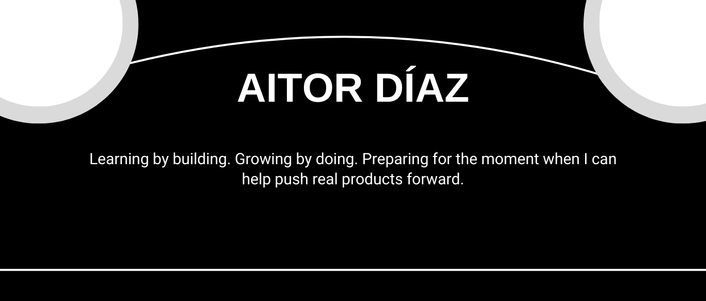

<h1 align="center">Hi there 👋, I'm Espadv69!</h1>

 🛠️ I build stuff on the web | 🔎 Always digging into new things | 📈 Preparing myself for what’s next

 

### 🌱 About Me

- 🧠 I code every day to sharpen my skills and prepare myself to contribute in a future tech team.
- 🔭 Currently open to new opportunities and exciting projects.
- 🌐 Focused on building fast, accessible, and user-friendly web applications.

---

### 🛠 Tech Stack

  

---

### 📌 Pinned Projects

> Check out my pinned repositories below 👇 — they reflect my growth and dedication as a developer.

---

### 📊 GitHub Stats

  
  

---

### 🧠 Fun Fact

> I believe consistency beats talent when talent doesn't show up — that’s why I code every day.

---

### 📬 Contact

> Portfolio and socials coming soon... stay tuned!

---

  💖 Thanks for visiting my profile!

